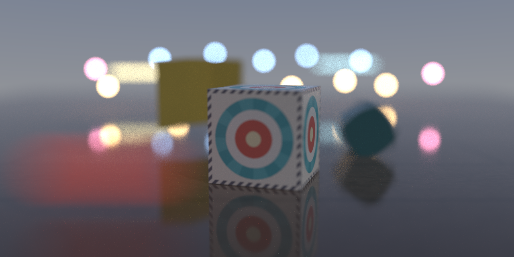
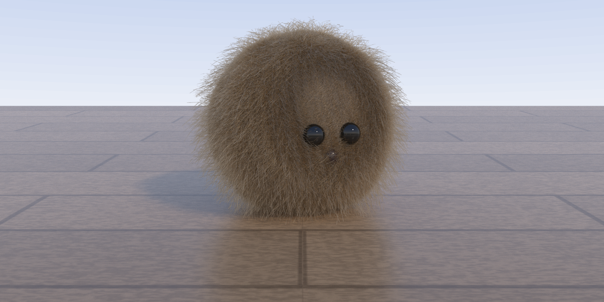
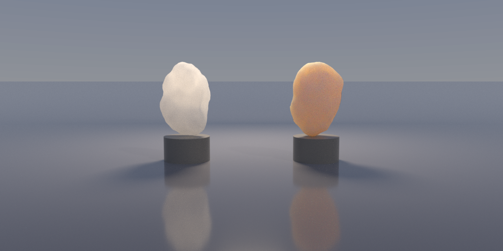

# render.rs

A RenderMan RIB renderer in Rust: a physically-based, path-traced renderer
that reads Pixar's RIB scene description and runs on two backends — a
multithreaded f64 CPU reference and a native Metal compute megakernel for
Apple GPUs. Built phase by phase from a Phong ray tracer into a renderer in
the spirit of modern PRMan, with every capability gated on a demo image and
a test suite that includes white-furnace energy checks and statistical
CPU/GPU parity.


*Motion blur, thin-lens depth of field, and bokeh — the camera tracks the
crate while the world streaks past ([more](renders/README.md)).*

## What it does

**Light transport.** Progressive Monte Carlo path tracing with next-event
estimation, multiple importance sampling (power heuristic), Russian
roulette, and firefly clamping. Scenes with many lights (tested to 1200+)
sample through a light BVH with power/distance importance. A Whitted
integrator remains as the fast direct-light preview (`--integrator whitted`
is the default; pass `--integrator path` for GI).

**Materials.** A PxrSurface-style über-material with PRMan-compatible
parameter names: Oren-Nayar diffuse, GGX specular with VNDF sampling and
height-correlated Smith shadowing, clearcoat, fuzz/sheen, rough dielectric
glass with true refraction, glow, presence cutouts, and random-walk
subsurface scattering (`subsurfaceGain/Color/Dmfp`). Hair gets its own
energy-conserving Marschner/d'Eon BSDF (`Bxdf "PxrMarschnerHair"`). Every
lobe is validated against a white furnace.


*400,000 cubic b-spline strands shaded with the Marschner hair BSDF.*

**Geometry.** All seven RiSpec quadrics; polygons (including
`GeneralPolygon` with holes); triangle meshes under a binned-SAH BVH with
two-level (BLAS/TLAS) instancing — billions of effective triangles via
`ObjectInstance`; Catmull-Clark subdivision surfaces with semi-sharp
creases; bicubic patch meshes with all standard bases; NURBS; fBm
displacement at dice time; curves/hair as rounded-cone capsule chains; and
`Points` particles.

**Volumes.** Participating media via `Atmosphere` and `Interior`:
homogeneous fog analytically, heterogeneous fBm clouds by delta tracking,
with ratio-tracked colored transmittance and Henyey-Greenstein phase.


*Backlit marble and skin — random-walk subsurface scattering bleeding
light through thin edges.*

**Textures & patterns.** A tiled-mip `.tex` texture format with a
`render txmake` converter, a sharded-LRU tile cache with a byte budget,
trilinear filtering driven by ray-cone footprints (no shimmer at grazing
angles), UDIM tile sets, and a pattern node graph
(texture/checker/fractal/mix/colorCorrect/ramp/triplanar) connected to
material parameters with `"reference"` declarations — compiled to Metal
Shading Language at runtime for the GPU.

**Camera.** Perspective and orthographic projections, thin-lens depth of
field, motion blur (transform and deformation, `MotionBegin`/`Shutter`),
box/triangle/gaussian pixel filters via filter importance sampling, and
adaptive sampling with variance-based stopping (`--adaptive`).

**Production output.** `--aovs` renders a full AOV stack — beauty,
diffuse/specular split, albedo, normal, depth, and object id with an
`Attribute "identifier"` manifest — written as a multilayer OpenEXR that
Nuke/Natron split by layer. `--denoise` runs an AOV-guided à-trous filter
on the diffuse layer (specular passes through raw, so glass stays sharp).
`--tonemap aces|srgb|linear` selects the display transform.

**Scale.** Binary RIB read/write (`render catrib`), `Procedural`
generators (`DelayedReadArchive`, `RunProgram`), checkpoint/resume for
long GPU renders (`--checkpoint`), and stress scenes to 772k instances /
35M effective triangles / 1200 lights at 4K.

See **[renders/README.md](renders/README.md)** for the full gallery — one
image per milestone, with what each demonstrates.

## Quick start

```bash
# Release build (the only sensible way to render)
cargo build --release

# Fast preview (Whitted, direct light only)
./target/release/render scene.rib -f png -o out.png

# Full global illumination on the GPU (macOS)
./target/release/render scene.rib --integrator path --backend metal \
    --spp 256 -f png -o out.png --tonemap aces

# Production AOVs to multilayer EXR, denoised beauty to PNG
./target/release/render scene.rib --integrator path --backend metal \
    --spp 128 --aovs -f exr -o out.exr
./target/release/render scene.rib --integrator path --backend metal \
    --spp 64 --denoise -f png -o out.png

# Long render with checkpoint/resume
./target/release/render big.rib --integrator path --backend metal \
    --spp 1024 --checkpoint ck.bin -f png -o out.png

# Tools
./target/release/render txmake texture.png texture.tex   # tiled-mip textures
./target/release/render catrib --binary in.rib out.brib  # binary RIB
```

Useful flags: `-w/-H` resolution override, `--spp` samples per pixel,
`--adaptive <tol>` variance-based stopping (CPU), `--threads`,
`--aov-dump <prefix>` per-layer PNGs, `RENDER_TEX_CACHE_MB` texture cache
budget, `RENDER_PT_BAND_ROWS` GPU dispatch sizing.

## The two backends

- **CPU** — the f64 reference implementation. Every feature lands here
  first; correctness fixtures (furnace tests, unbiased-estimator checks,
  BVH brute-force cross-checks) run against it.
- **Metal** — an f32 compute megakernel, compiled from embedded MSL at
  runtime (no build-time GPU toolchain). The scene is flattened once into
  `#[repr(C)]` buffers shared byte-identically by both sides; pattern
  graphs are code-generated into the kernel per scene. Parity with the CPU
  is *statistical* (same light transport, independent float error) and
  enforced by mean/RMSE tests on every subsystem: textures, hair, motion
  blur, volumes, SSS, many-light sampling.

Typical numbers on Apple Silicon: the 10-billion-effective-triangle glade
at 720p/96spp in 84s (178s CPU); the still life at 1280×640/1024spp in
52s; a 4K forest frame (772k instances, 1200 lights) at 64spp in ~1 hour
on the megakernel.

## RIB compliance

The policy is *accept everything*: any syntactically valid RIB parses
(text or binary), implemented requests take effect, and everything else
warns once and is skipped. [COMPLIANCE.md](COMPLIANCE.md) tracks every
request — implemented, partial, deferred, or skipped-forever (REYES-era
constructs like `SolidBegin` and RSL shaders are consciously out of
scope; the modern Bxdf/Pattern/Light path replaces them).

Highlights: full graphics-state machinery (attribute/transform blocks,
named coordinate systems, `Basis`, `ShadingRate`-driven dicing),
`ReadArchive`/`ArchiveBegin`/`ObjectInstance`, `MotionBegin`, media
requests, `Attribute "identifier"`, and modern `Bxdf`/`Light`/`Pattern`/
`Displace` with PRMan parameter names.

## Architecture

```
src/
  parser/       nom tokenizer -> generalized request stream -> SceneBuilder
                (binary RIB decoder, catrib encoder)
  scene/        camera, lights (+ light BVH sampler), materials, media,
                envmap (HDRI 2D-CDF importance sampling)
  geometry/     quadrics, meshes, subdivision, patches/NURBS, curves,
                displacement, ear-clipping
  accel/        binned-SAH BVH (BLAS/TLAS)
  raytracer/
    pt/         the CPU path tracer: bxdf lobes, hair BSDF, volumes, SSS
    metal/      GPU scene flattening, runtime MSL compilation, the
                path-tracing megakernel, pattern-graph codegen
  texture/      .tex format, sharded-LRU tile cache, pattern node graph
  output/       film/AOVs, multilayer EXR, denoiser, tonemaps, PNG/PPM
```

Design decisions that shaped everything: one `#[repr(C)]` scene
representation consumed by both backends; f32 render core with f64 scene
composition; RGB radiance behind a spectrum-shaped API; megakernel until
measured divergence justifies wavefront (the 4K forest hit that trigger —
it's the designated next optimization); OSL staged behind the native
pattern graph.

## Testing

~140 tests: unit tests per subsystem, white-furnace energy conservation
for every BSDF lobe and the hair model, unbiased-estimator checks for
volume sampling (verified against closed forms and quadrature),
pixel-exact parity for the Whitted GPU path, statistical parity
(mean + RMSE + determinism) for the path-traced GPU on every feature, and
a parser fuzz test (arbitrary bytes must never panic).

```bash
cargo test --release
```

## Status & roadmap

Phases P0-P11 of [ROADMAP.md](ROADMAP.md) are complete — RIB
generalization, the path-tracing pivot, meshes/BVH/instancing, the Metal
port, PBR materials and lights, subdivision/patches/displacement, textures
and patterns, camera and motion, hair, movie-scale infrastructure,
volumes/SSS, and the production pipeline. Deferred items are recorded
honestly where they were skipped: wavefront GPU scheduling, OSL via FFI,
OIDN, interactive preview, EWA filtering, VDB ingest, deep EXR, USD.

## License

MIT

## Author

Built with Claude Code as a RenderMan renderer reimplementation project.
