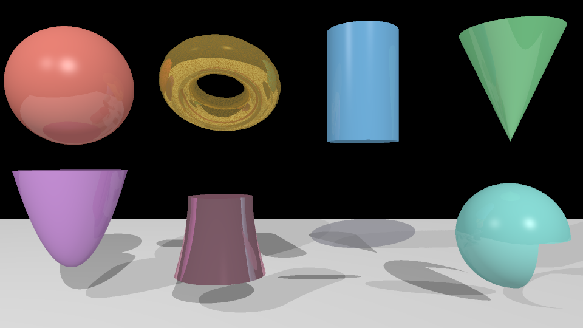
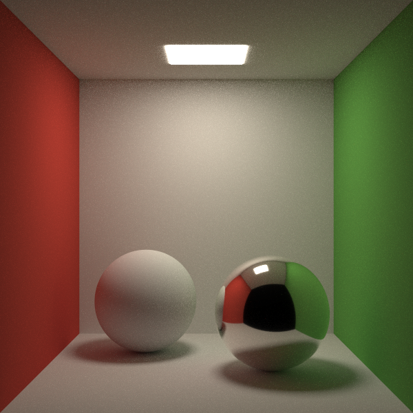
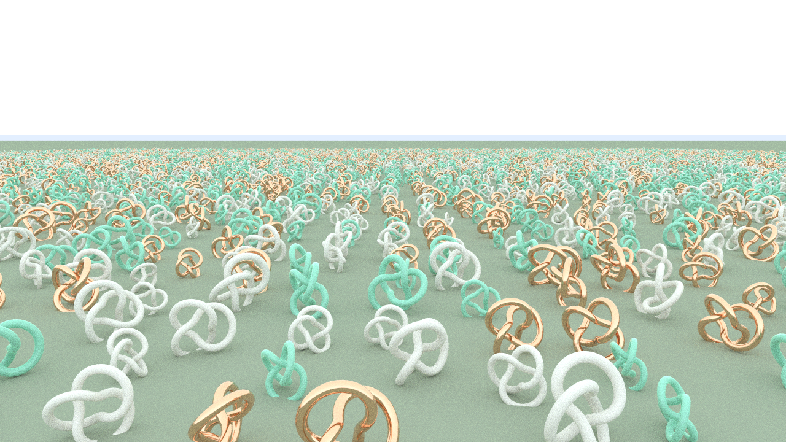
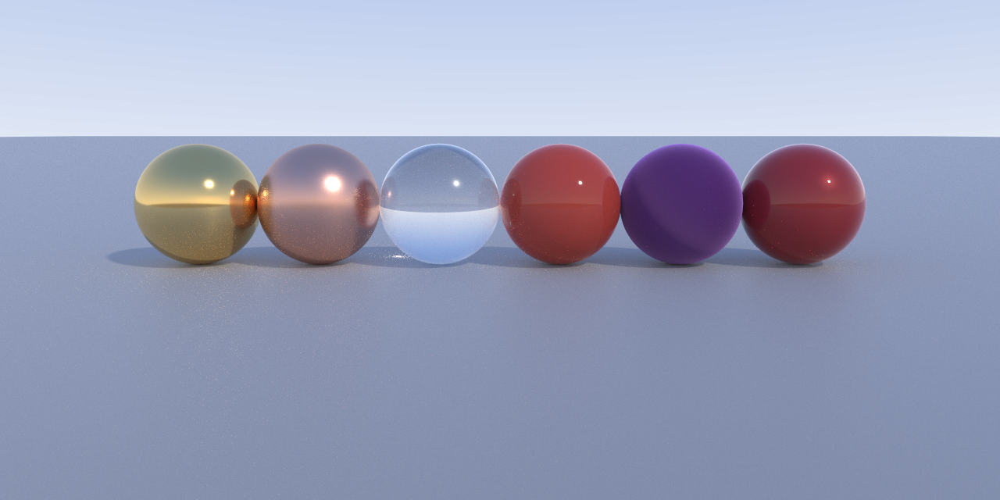
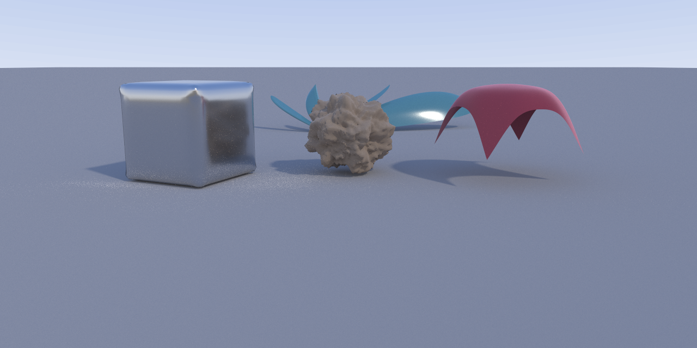
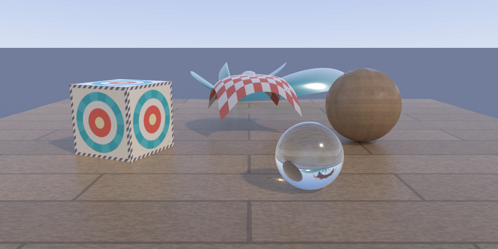
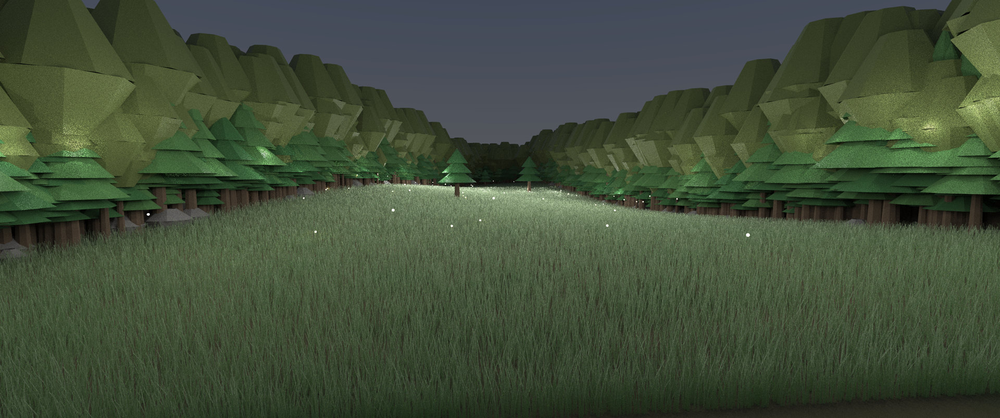
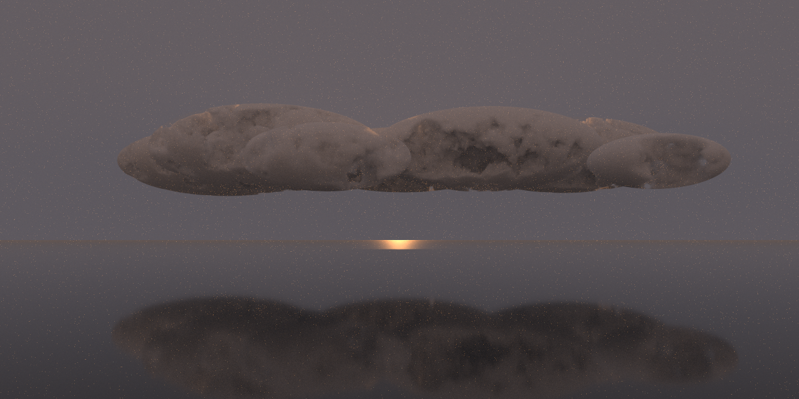
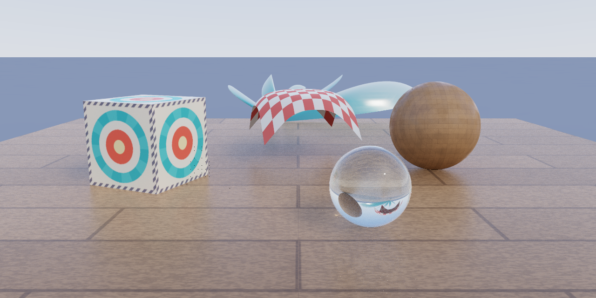

# Gallery

Every phase of the [roadmap](../ROADMAP.md) gated on a demo image that was
impossible before it — this directory is that history, in order. Each
image names its fixture in `tests/fixtures/` so it can be re-rendered.

---

## Phase 0 — Speak RIB properly



**`quadric_zoo.png`** · `quadric_zoo.rib` · Whitted integrator

All seven RiSpec quadrics — sphere, cone, cylinder, torus, disk,
paraboloid, hyperboloid — with partial sweeps (`thetamax`), placed through
the full transform stack. The gate for the generalized RIB parser: any
classic PRMan sample file parses, unknown requests warn and skip.

---

## Phase 1 — The path-tracing pivot



**`cornell.png`** · `cornell.rib` · path integrator, CPU

The classic Cornell box, and the classic reasons for it: color bleeding
from the red and green walls, a soft area-light shadow, progressive Monte
Carlo convergence. The first global-illumination image — everything after
this builds on the path tracer it proved.

---

## Phase 2 & 3 — Triangles at scale, then on the GPU



**`glade.png`** (CPU) / **`glade_metal.png`** (Metal) · generated by
`scripts/gen_glade.py`

Ten thousand instances of a million-triangle knot mesh — ten billion
effective triangles — through a binned-SAH BVH with two-level
instancing. The pair of images is the point: the Metal megakernel renders
the same flattened scene buffers as the CPU and must agree statistically
(84s GPU vs 178s CPU at 720p/96spp when first measured).

---

## Phase 4 — Physically-based materials and lights



**`shaderball.png`** · `shaderball.rib` · path integrator, Metal

The "looks real" gate: gold, glass, velvet, car paint, plastic, and matte
shaderballs under an HDRI dome with importance sampling. Every PxrSurface
lobe here passed a white-furnace test first — the material system
conserves energy by proof, not by eye.

---

## Phase 5 — Subdivision, patches, displacement



**`surfaces.png`** · `surfaces.rib` · path integrator, Metal

Four surface systems in one frame: a Catmull-Clark subdivision cube with
semi-sharp creases (the beveled steel die), an fBm-displaced subdivision
rock, a draped b-spline patch-mesh cloth with the fuzz lobe, and a teal
NURBS band — all diced to triangles at build time, so the GPU never knew.

---

## Phase 6 — Textures and pattern graphs



**`stilllife.png`** · `stilllife.rib` · path integrator, Metal

A 2×2 UDIM parquet deck served from the tiled-mip texture cache, a
label-textured crate graded through `PxrColorCorrect`, a triplanar wood
sphere with fractal-driven roughness, a `PxrChecker` picnic cloth, and a
`PxrRamp` NURBS band. The gate criterion was the deck: at 16 spp the
grazing-angle planks show Monte Carlo noise but **no texture shimmer** —
ray-cone mip selection at work.

---

## Phase 7 — Camera and motion


**`pan.png`** · `pan.rib` · path integrator, Metal, 2048 spp

A tracked "pan": the label crate sits sharp at the focal plane while a
tumbling cube and a speeding ball streak with transform motion blur, a
banner flaps with deformation blur, and the glow spheres behind the focal
plane bloom into thin-lens bokeh — two of them smeared sideways because
they are *moving* bokeh. Gaussian pixel filter throughout.

---

## Phase 8 — Curves, hair, fur


**`furball.png`** · `furball.rib` + `scripts/gen_groom.py` · path
integrator, Metal, 1024 spp

400,000 cubic b-spline strands (6.4 million rounded-cone segments) with
clumping, gravity droop, sparse guard hairs, and a face mask so the eyes
read. Shaded by the energy-conserving Marschner/d'Eon hair BSDF — the
warm glints in the coat are the TT transmission lobe, light passing
*through* fibers. The white-furnace test for the hair model passed on its
first run.

---

## Phase 9 — Movie scale



**`forest.png`** · `forest.rib` + `scripts/gen_forest.py` · path
integrator, Metal, 3840×1608, 64 spp

The stress gate: 772,120 instanced trees and rocks (35M effective
triangles) loaded from a **binary RIB** archive through `Procedural
"DelayedReadArchive"`, 660k grass hair segments, and **1,201 lights** —
1,200 fireflies plus the dusk dome — sampled through the light BVH. Look
closely at the grass: individual fireflies pool light around themselves,
which uniform light selection could never resolve at 64 spp. The
hour-long render survived GPU watchdog kills via checkpoint/resume.

---

## Phase 10 — Volumes and subsurface scattering



**`clouds.png`** · `clouds.rib` · path integrator, Metal, 768 spp

Heterogeneous fBm cloud banks in invisible hull spheres over a glossy
sea: delta-tracked distance sampling, ratio-tracked transmittance, and
strong forward scattering (Henyey-Greenstein g = 0.62) giving the warm
rims where the horizon sun shines through cloud edges. A bounded
atmosphere adds the aerial perspective and the sun's glitter path.


**`bust.png`** · `bust.rib` · path integrator, CPU, 1024 spp

Marble and skin, strongly backlit. Both busts are displaced subdivision
blobs shaded *only* by random-walk subsurface scattering — no diffuse
lobe at all. The glow at the thin edges is light that entered the back,
walked through the interior, and exited toward the camera. The skin's
red-shifted bleed comes from per-channel mean free paths
(`subsurfaceDmfp [0.32 0.17 0.09]`).

---

## Phase 11 — The production pipeline



**`prodshot.png`** · `stilllife.rib` · path integrator, Metal, 256 spp,
`--denoise --tonemap aces`

The Phase 6 still life, finished like a production frame: rendered with
the full AOV stack, the diffuse layer denoised by the albedo/normal/
depth/id-guided à-trous filter (the specular layer passes through raw, so
the glass ball keeps every refracted detail), and graded through the ACES
filmic transform. The companion `stilllife_aovs.exr` (not in git — 44 MB)
is the multilayer EXR with beauty, diffuse, specular, albedo, N, depth,
and id layers plus the object-name manifest; regenerate it with:

```bash
./target/release/render tests/fixtures/stilllife.rib --integrator path \
    --backend metal --spp 256 --aovs -f exr -o renders/stilllife_aovs.exr
```

---

## Early development

**`three_primitives.png`**, **`shadows.png`**, **`materials.png`**,
**`transforms.png`**, **`scene.png`**, **`bright.png`**,
**`showcase.png`**, **`showcase_bright.png`** — Whitted-era test images
from before the roadmap: Phong shading, hard shadows, mirror
reflections. Kept as the "before" picture.
